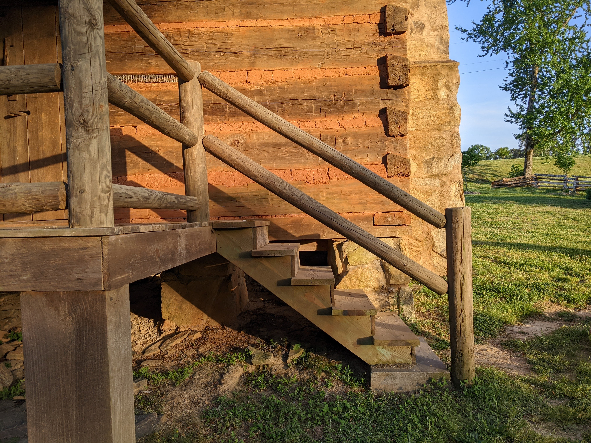
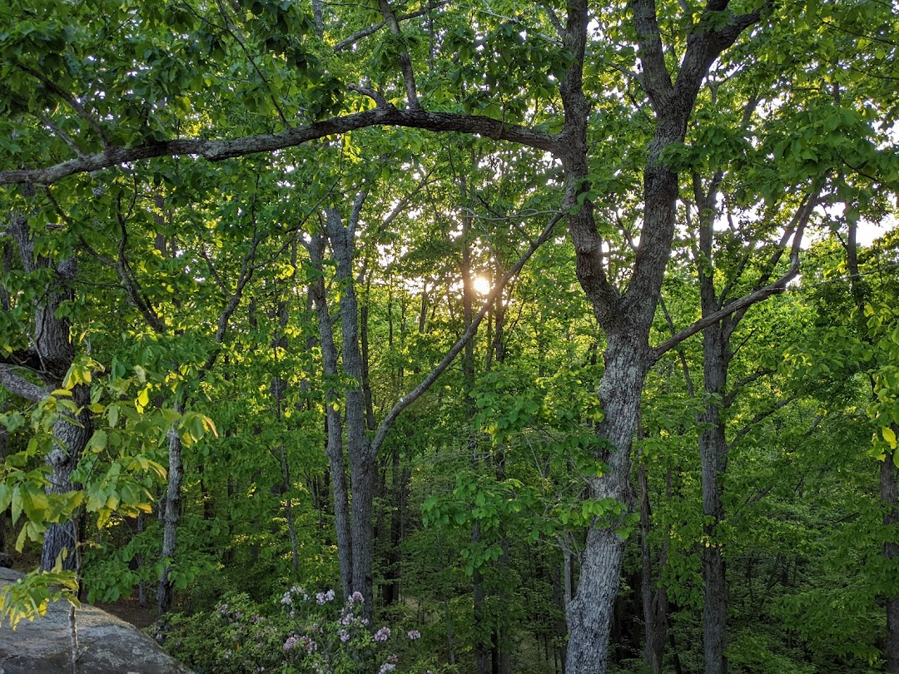

Here are a couple shortcodes that are enabled. This is just for reference.

````html
{{\% columns \%}}
{{\% column \%}}
{{\% endcolumns \%}}
````

{}  
Will make some nice columns to work with.  
{}  
Here we are on the right hand side.  
{}

How do columns look with an img?

{}  
  {}  
{}  
And a bunch of wonderful text on the right side of the page. This may or may not look good. Will have to see how it renders! Would be cool for that publication look, right?  
{}

{}  
And a bunch of wonderful text on the right side of the page. This may or may not look good. Will have to see how it renders! Would be cool for that publication look, right?  
{}  
  {}  
{}

````html
{{\% figure src="/media/202204280730_cherokeeBluffs.jpg" \%}}

{{\% gallery %}}
	{{\% figure src="/media/202204280730_cherokeeBluffs.jpg" title="Cherokee Bluffs 1" \%}}
	{{\%figure src="/media/202202191038_graysonHIghlands.jpg" title="Grayson Highlands" \%}}
	{{\% figure src="/media/202204280726_cherokeeBluffs.jpg" title="Cherokee Bluffs 2" \%}}
{{\% /gallery >}}
````

And we've got a nice gallery if we want it.

{}

{}  
{}  
{}  
{}  
{}
